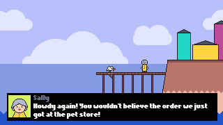

# Flappy Delivery Co.

[play here](https://exelo.tl/misc/flappy-delivery-co/)

This is a small game I made in 5 days for a job interview in early 2018.

It's a flappy bird with a colourful cast of characters and a variety of items!

The game is written in a fairly clean and modern ES6 style, using [FuseBox](https://fuse-box.org/) as a watcher/bundler.

It has a tiny custom engine which uses HTML elements for all the graphics. 

Features include:
- scenes with actors
- independent update/draw (to the extent which that makes sense for moving `
`'s around)
- spritesheets and animations
- hitboxes
- event system

I've since revisited the game to make some small improvements with the help of some third party libraries:
- use [Howler](https://howlerjs.com/) for more stable audio, gapless looping etc.
- add a preloader scene for images and sounds (and fonts via [FontFaceObserver](https://fontfaceobserver.com/))
